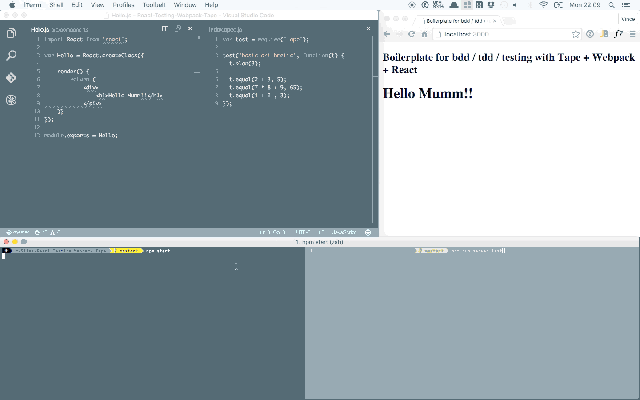

# React-Testing-Webpack-Tape

Boilerplate for bdd / tdd / testing with Tape + Testem + Webpack + React

recompiles + re-runs test on file updates!





## Installation

```javascript
npm install //install dependencies
```


## Usage

```javascript
npm start //start webpack-dev-server with react-hot-loader
```

Open another terminal tab and then :

```javascript 
npm test //start testem + tape
```

## Dependencies

[tape](https://github.com/substack/tape) - tap-producing test harness for node and browsers

[testem](https://github.com/airportyh/testem) - test runner

[webpack](https://github.com/airportyh/testem) - a bundler for JavaScript

[webpack-dev-server](https://github.com/webpack/webpack-dev-server) - updates browsers on changes

[react](https://github.com/facebook/react) - View for our app

[react-hot-loader](https://github.com/gaearon/react-hot-loader) - used for hot reloading

[babel](https://github.com/babel/babel) - compiler for converting ES6


## Not quite right?

I'm unsure if the use of glob to compile my tests is the fastest way pretty sure there should be a way with webpack. Feel free to contribute or open issues if you spot errors =)
